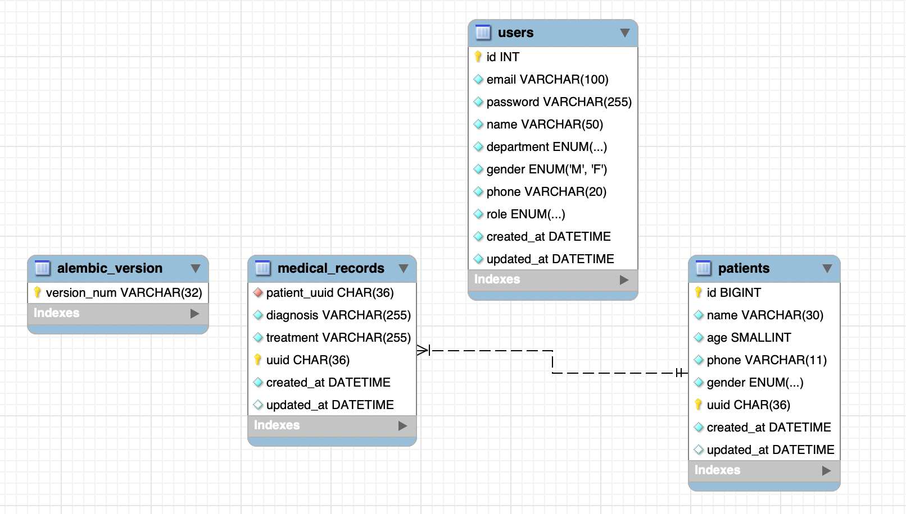

# 3일차 - DB 마이그레이션

## 1. User 모델 (`app/models/user.py`)

SQLAlchemy ORM을 활용하여 작성한 User 테이블 모델입니다.

### 컬럼 구성

| 컬럼       | 타입         | 설명                        |
| ---------- | ------------ | --------------------------- |
| id         | Integer (PK) | 자동 증가 고유 ID           |
| email      | String(100)  | 이메일 (unique)             |
| password   | String(255)  | 비밀번호 (해시)             |
| name       | String(50)   | 이름                        |
| department | Enum         | 부서 (연구/의료/개발)       |
| gender     | Enum         | 성별 (M/F)                  |
| phone      | String(20)   | 휴대폰 번호                 |
| role       | Enum         | 권한 (대기자/스태프/어드민) |
| created_at | DateTime     | 생성일시                    |
| updated_at | DateTime     | 수정일시                    |

<br>

## 2. Patient 모델 (`app/models/patient.py`)

SQLAlchemy ORM을 활용하여 작성한 Patient 테이블 모델입니다.

### ## Patients (환자 정보 테이블)

- **테이블 영문명:** `patients`
- **설명:** 시스템에 등록된 환자의 기본 인적 사항 및 관리 정보를 저장하는 테이블

| 컬럼명 (Column) | 데이터 타입 (Type) | 제약 조건 (Key/Null) | 기본값 (Default)  | 설명 (Description)                         |
| --------------- | ------------------ | -------------------- | ----------------- | ------------------------------------------ |
| **id**          | BIGINT             | PK, Auto Increment   | _None_            | 고유 식별자 (일련번호)                     |
| **name**        | VARCHAR(30)        | NOT NULL             | _None_            | 환자 성명                                  |
| **age**         | SMALLINT           | NOT NULL             | _None_            | 환자 나이                                  |
| **gender**      | ENUM / GENDER      | NULL                 | _None_            | 환자 성별 (`gender` 사용자 정의 타입 권장) |
| **phone**       | VARCHAR(11)        | NOT NULL             | _None_            | 환자 연락처 (국내 전화번호 11자리 제한)    |
| **created_at**  | DATETIME           | NOT NULL             | CURRENT_TIMESTAMP | 환자 정보 최초 등록 일시                   |
| **updated_at**  | DATETIME           | NULL                 | _None_            | 환자 정보 최종 수정 일시                   |

---

### ### 제약 조건 및 특이사항 (Technical Notes)

- **`id`**: 데이터의 무결성과 확장성을 보장하기 위해 `BIGINT` 타입을 사용하며, 새로운 행이 추가될 때마다 1씩 자동으로 증가합니다.
- **`gender`**: 코드 내의 `GenderEnum`과 맵핑되는 컬럼으로, 설계에 따라 `ENUM('MALE', 'FEMALE', ...)` 형태 또는 문자열로 로컬 MySQL에 구현됩니다.
- **`phone`**: 국내 휴대폰 번호 포맷(예: `01012345678`)을 하이픈 없이 11자리 상수로 엄격하게 정형화하여 저장합니다.

<br>
<br>
<br>
<br>

# Alembic 마이그레이션

## 1. User - 마이그레이션 파일 생성

```bash
uv run alembic revision --autogenerate -m "create users table"
```

### DB 적용

```bash
uv run alembic upgrade head
```

### 생성된 마이그레이션 파일

- `alembic/versions/539e9fcee66d_create_users_table.py`

### 3. DB 스키마 확인 (DBeaver)

[users 테이블 확인]

## 2. Patient - 마이그레이션

## DB 뷰어 확인


