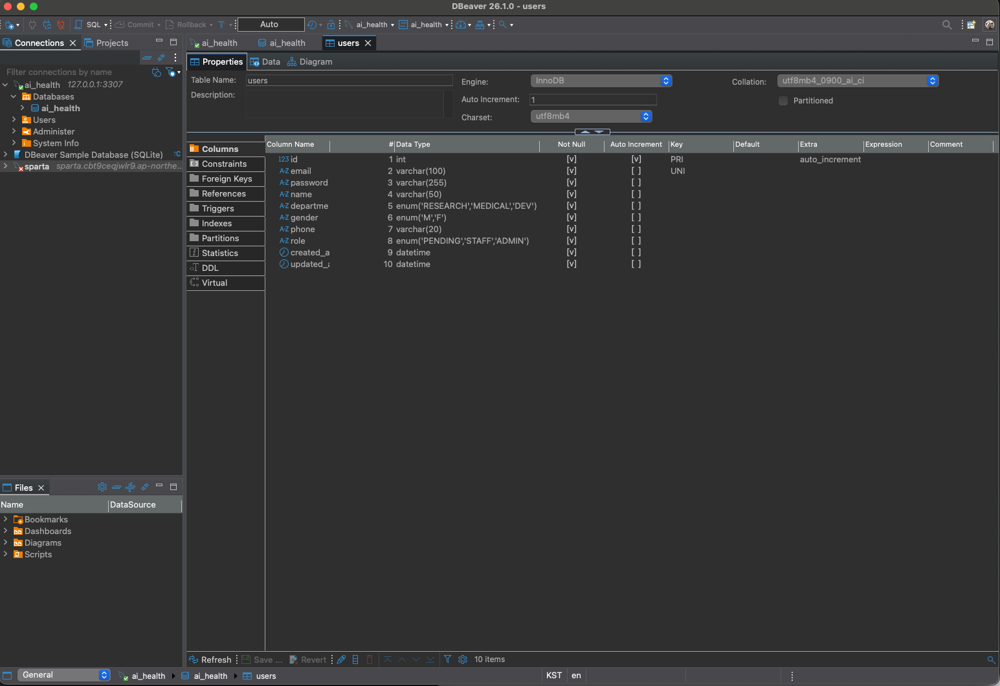
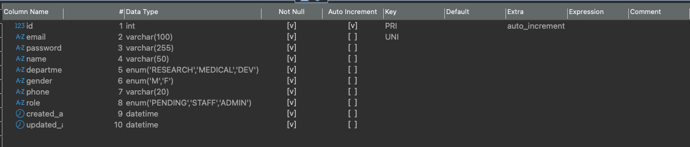

# 3일차 - DB 마이그레이션

## 1. User 모델 (`app/models/user.py`)

SQLAlchemy ORM을 활용하여 작성한 User 테이블 모델입니다.

### 컬럼 구성

| 컬럼 | 타입 | 설명 |
|------|------|------|
| id | Integer (PK) | 자동 증가 고유 ID |
| email | String(100) | 이메일 (unique) |
| password | String(255) | 비밀번호 (해시) |
| name | String(50) | 이름 |
| department | Enum | 부서 (연구/의료/개발) |
| gender | Enum | 성별 (M/F) |
| phone | String(20) | 휴대폰 번호 |
| role | Enum | 권한 (대기자/스태프/어드민) |
| created_at | DateTime | 생성일시 |
| updated_at | DateTime | 수정일시 |

## 2. Alembic 마이그레이션

### 마이그레이션 파일 생성
```bash
uv run alembic revision --autogenerate -m "create users table"
```

### DB 적용
```bash
uv run alembic upgrade head
```

### 생성된 마이그레이션 파일
- `alembic/versions/539e9fcee66d_create_users_table.py`

## 3. DB 스키마 확인 (DBeaver)

[users 테이블 확인]