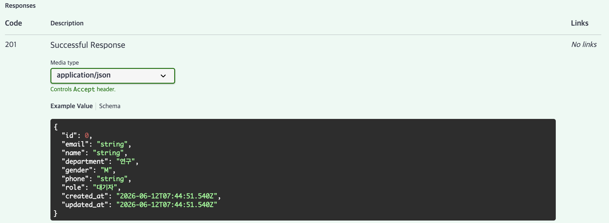
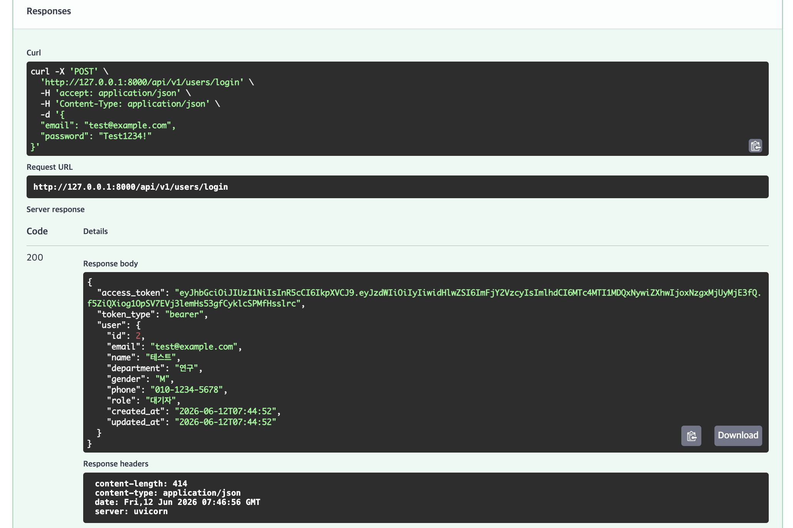
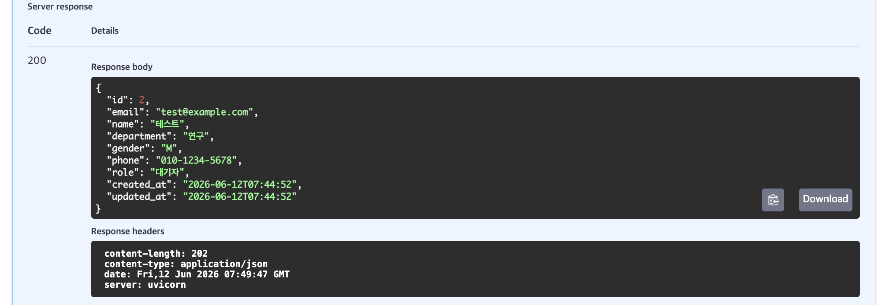
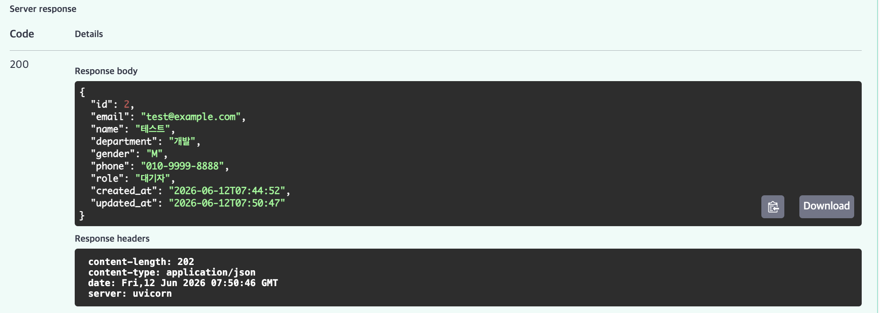
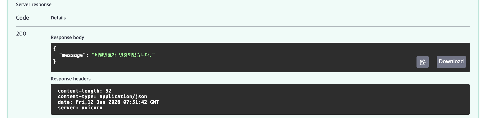
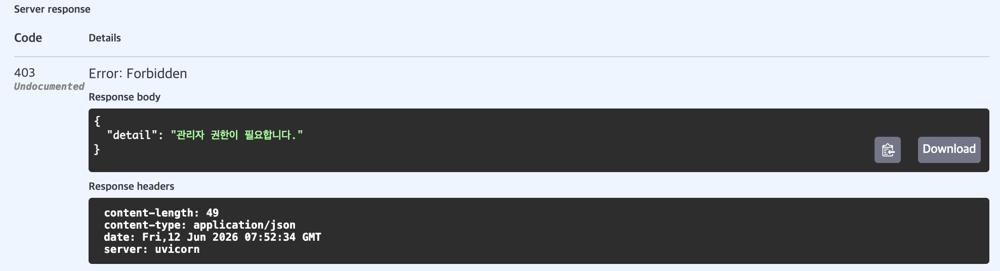
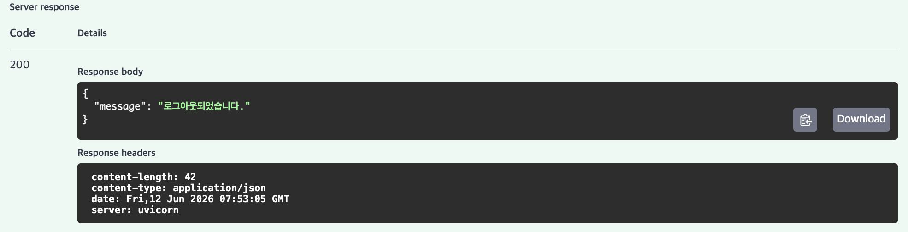
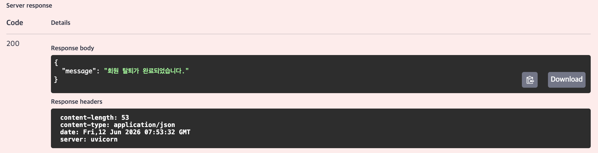

# User Management API Test Documentation

## 1. 회원가입 (POST /api/v1/users/signup)

## 2. 로그인 (POST /api/v1/users/login)

## 3. 마이페이지 조회 (GET /api/v1/users/me)

## 4. 회원 정보 수정 (PATCH /api/v1/users/me)

## 5. 비밀번호 변경 (PATCH /api/v1/users/me/password)

## 6. 회원 목록 조회 - Admin 권한 확인 (GET /api/v1/users)

## 7. 로그아웃 (POST /api/v1/users/logout)

## 8. 회원 탈퇴 (DELETE /api/v1/users/me)

